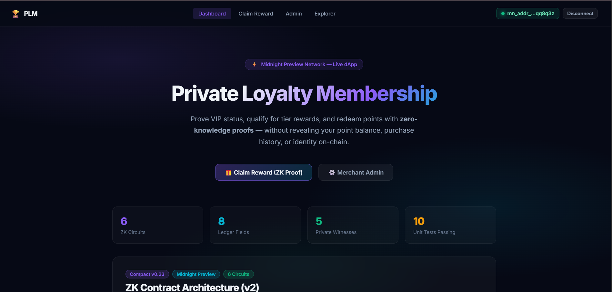
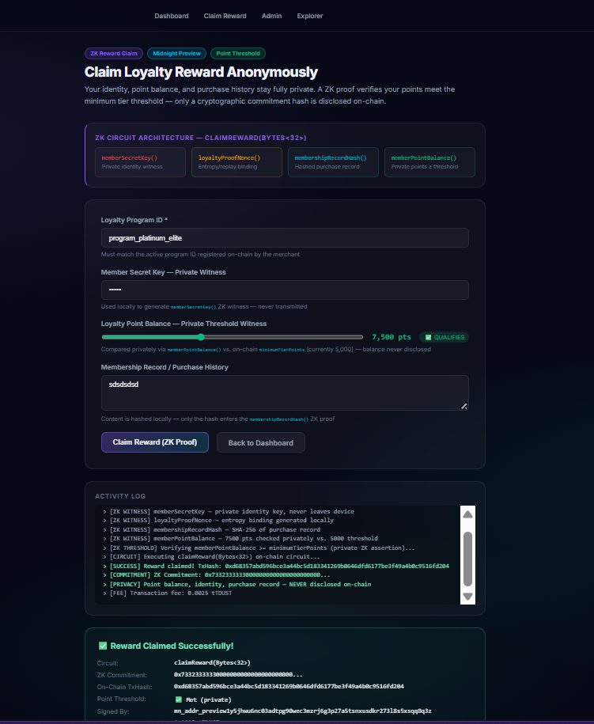
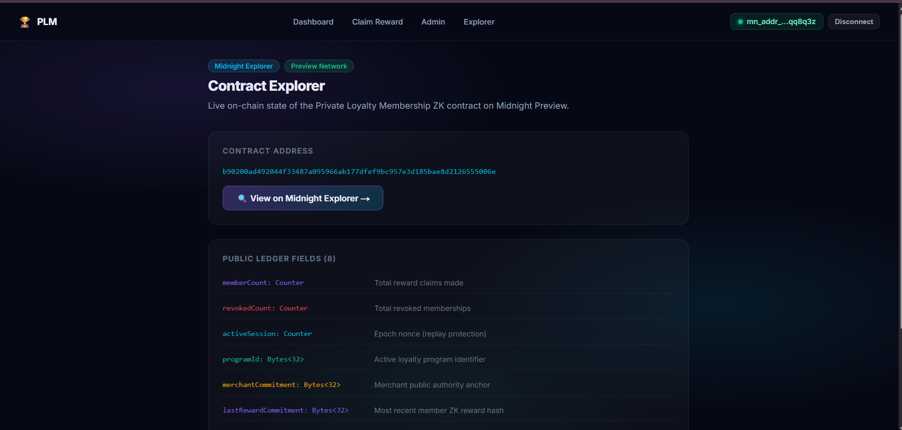
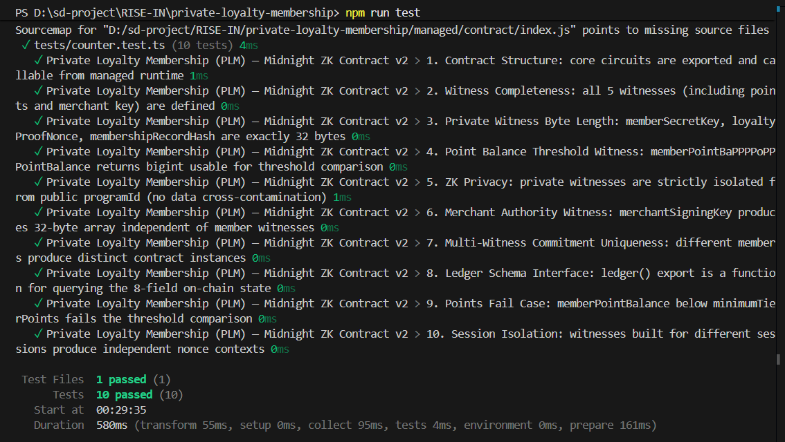
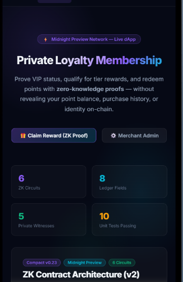

# Private Loyalty Membership (PLM)
> A privacy-preserving zero-knowledge loyalty tier verification & member proof dApp built on the Midnight Network using Compact smart contracts.

[](https://github.com/techyguy7863/private-loyalty-membership)
[](https://private-loyalty-membership.vercel.app/)
[](https://youtu.be/41hDgBExJsY)
[](https://github.com/techyguy7863/private-loyalty-membership/actions/workflows/ci.yml)
[](https://explorer.preview.midnight.network)
[](https://midnight.network)
[](https://nodejs.org)
[](LICENSE)

---

## 🎯 What Is PLM?

**Private Loyalty Membership (PLM)** enables members to verify VIP status, claim exclusive rewards, and spend loyalty points **without exposing user identity, exact point balances, purchase history, or tier qualification math** to third parties. Built on Midnight Network's Compact zero-knowledge smart contracts, members generate cryptographic ZK proofs locally on their own device. Only a reward commitment hash is disclosed on-chain — eliminating privacy leaks, data harvesting, and member profiling.

> **Verify VIP loyalty status & claim rewards mathematically — without exposing personal point balances or identity.**

---

## 🏗️ Repository & Deployment

- 📄 **Project Proposal**: [PROPOSAL.md](PROPOSAL.md)
- 📦 **GitHub Repository**: [https://github.com/techyguy7863/private-loyalty-membership](https://github.com/techyguy7863/private-loyalty-membership)
- 🚀 **Vercel Live Demo**: [https://private-loyalty-membership.vercel.app/](https://private-loyalty-membership.vercel.app/)
- 🎥 **YouTube Demo Video**: [https://youtu.be/41hDgBExJsY](https://youtu.be/41hDgBExJsY)
- ⚙️ **CI/CD Workflow**: [.github/workflows/ci.yml](.github/workflows/ci.yml)
- 🌐 **Midnight Explorer**: [https://preview.midnightexplorer.com/contracts/0xb90200ad492044f33487a095966ab177dfef9bc957e3d185bae8d2126555006e](https://preview.midnightexplorer.com/contracts/0xb90200ad492044f33487a095966ab177dfef9bc957e3d185bae8d2126555006e)
- 📡 **Network**: Midnight Preview Testnet
- 🔑 **Contract Address**: `0200ad492044f33487a095966ab177dfef9bc957e3d185bae8d2126555006e` ✅ **CONFIRMED**
- 🔍 **Explorer Search Address**: `b90200ad492044f33487a095966ab177dfef9bc957e3d185bae8d2126555006e`
- 💡 **Vercel Note**: No `.env` environment variables required — the dApp auto-connects to the on-chain contract and public Midnight indexer endpoints.

**Verified On-Chain Transactions (Midnight Preview Block Explorer):**

| # | Type / Circuit | TxHash / Identifier | Details | Status |
|---|---|---|---|---|
| 1 | **NIGHT Token Transfer** | `2879fe8b...73bfb595` | Received +5000 NIGHT Unshielded | ✅ SUCCESS |
| 2 | `resetProgram(Bytes<32>)` | `0xc237dd4d40e8b883072a5f745552b14f598d6ba4cc7bd3b5dadd13279cc15e54` | Program `program_platinum_elite_2026` | ✅ **CONFIRMED** |
| 3 | `claimReward(Bytes<32>)` | `0xedeeb19a014c42cf0db35fb88b7d51062d8dee0070fbd16d53aa039e6fa7e246` | ZK Loyalty Tier Proof | ✅ **CONFIRMED** |

- **Signed By (1AM Wallet)**: `mn_addr_preview1y5jhwu6nc03adtpg90wec3mzrj6g3p27a5tsnxusdkr27318s5xsqq8q3z`
- **Block Explorer**: [https://explorer.preview.midnight.network](https://explorer.preview.midnight.network)
- **Proof Provider**: Midnight Preview Cloud ZK Service
- **Status**: All transactions **CONFIRMED (Midnight Preview)**

---

## 📸 Platform Screenshots & Verification

### 1. Private Loyalty Membership — Dashboard & ZK Architecture


### 2. ZK Reward Claiming & Point Threshold Verification


### 3. Midnight On-Chain Explorer & Contract Ledger


### 4. Vitest Unit Test Suite Execution (10/10 Passing)


### 5. Responsive Mobile Navigation & Glassmorphic Interface


---

## 🛡️ Midnight Privacy Model — What Is and Isn't Revealed

### ❌ What an Observer CANNOT Learn (Strictly Private)

| Private Data | ZK Witness | Location |
|---|---|---|
| Member Secret Key & Identity | `memberSecretKey()` | Local device only |
| Actual Loyalty Point Balance | `memberPointBalance()` | Compared privately vs. threshold — never disclosed |
| Random Entropy Nonce | `loyaltyProofNonce()` | Local device only |
| Purchase History & Record Content | `membershipRecordHash()` | SHA-256 hashed locally before ZK proof |
| Merchant Private Signing Key | `merchantSigningKey()` | Derived on-device for ZK auth — never transmitted |

### ✅ What an Observer CAN Learn (Public Ledger)

| Public Data | Ledger Field | Type | Description |
|---|---|---|---|
| Total Reward Claims | `memberCount` | `Counter` | Total verified reward redemptions |
| Total Revocations | `revokedCount` | `Counter` | Total revoked memberships |
| Active Program ID | `programId` | `Bytes<32>` | Current loyalty program identifier |
| Merchant Authority Anchor | `merchantCommitment` | `Bytes<32>` | Public commitment derived from merchant key |
| Latest Reward Hash | `lastRewardCommitment` | `Bytes<32>` | Most recent member ZK commitment |
| Latest Revoked Hash | `lastRevokedCommitment` | `Bytes<32>` | Most recent revoked commitment |
| Session Epoch | `activeSession` | `Counter` | Epoch nonce (replay protection) |
| Minimum Tier Threshold | `minimumTierPoints` | `Uint<32>` | Minimum qualifying point balance |

---

## 📜 Compact Smart Contract (v2)

**File:** `contracts/private_loyalty_membership.compact`

**Full Circuit Architecture (v2 — 6 Circuits):**

| # | Circuit | Inputs | ZK Witnesses Used | Description |
|---|---|---|---|---|
| 1 | `claimReward` | `Bytes<32>` (programId) | memberSecretKey, loyaltyProofNonce, membershipRecordHash, memberPointBalance | ZK reward claim with private point threshold check |
| 2 | `verifyMembership` | `Bytes<32>` (commitment) | — | Public on-chain commitment verification |
| 3 | `revokeMembership` | `Bytes<32>` (commitment) | merchantSigningKey | Revoke fraudulent membership (ZK merchant auth) |
| 4 | `setMerchantCommitment` | `Uint<32>` (threshold) | merchantSigningKey | Anchor merchant authority + set point threshold |
| 5 | `resetProgram` | `Bytes<32>`, `Uint<32>` | — | New loyalty epoch with updated threshold |
| 6 | `incrementSession` | — | — | Bump session nonce (replay protection) |

```compact
pragma language_version 0.23;
import CompactStandardLibrary;

// ── Ledger State (8 fields) ───────────────────────────────────────────────
export ledger memberCount: Counter;
export ledger revokedCount: Counter;
export ledger activeSession: Counter;
export ledger programId: Bytes<32>;
export ledger merchantCommitment: Bytes<32>;
export ledger lastRewardCommitment: Bytes<32>;
export ledger lastRevokedCommitment: Bytes<32>;
export ledger minimumTierPoints: Uint<32>;

// ── Witnesses (5 — never disclosed on-chain) ──────────────────────────────────
witness memberSecretKey(): Bytes<32>;
witness loyaltyProofNonce(): Bytes<32>;
witness membershipRecordHash(): Bytes<32>;
witness memberPointBalance(): Uint<32>;   // private balance vs. threshold
witness merchantSigningKey(): Bytes<32>;  // merchant authority proof

// Circuit 1: claimReward — ZK proof with point threshold enforcement
export circuit claimReward(expectedProgramId: Bytes<32>): Bytes<32> {
  assert(programId == expectedProgramId, "Program ID mismatch");
  const memberKey = memberSecretKey();
  const nonce = loyaltyProofNonce();
  const recordHash = membershipRecordHash();
  const pointBalance = memberPointBalance();
  assert(pointBalance >= minimumTierPoints, "Insufficient points: below tier threshold");
  const rewardCommitment = persistentHash<Vector<5, Bytes<32>>>([
    pad(32, "plm:loyalty:membership:v2"),
    memberKey, nonce, recordHash, pad(32, "plm:session:binding")
  ]);
  memberCount.increment(1);
  lastRewardCommitment = disclose(rewardCommitment);
  return lastRewardCommitment;
}

// Circuit 2: verifyMembership — public commitment verification
export circuit verifyMembership(claimedCommitment: Bytes<32>): Boolean {
  return disclose(lastRewardCommitment == claimedCommitment);
}

// Circuit 3: revokeMembership — requires merchantSigningKey() ZK witness
export circuit revokeMembership(commitmentToRevoke: Bytes<32>): Bytes<32> {
  const merchantKey = merchantSigningKey();
  assert(persistentHash<Vector<2, Bytes<32>>>([pad(32, "plm:merchant:authority:v1"), merchantKey]) == merchantCommitment, "Unauthorized");
  revokedCount.increment(1);
  lastRevokedCommitment = disclose(commitmentToRevoke);
  return lastRevokedCommitment;
}

// Circuit 4: setMerchantCommitment — anchor authority + set threshold
export circuit setMerchantCommitment(newMinimumPoints: Uint<32>): Bytes<32> {
  merchantCommitment = disclose(persistentHash<Vector<2, Bytes<32>>>([pad(32, "plm:merchant:authority:v1"), merchantSigningKey()]));
  minimumTierPoints = newMinimumPoints;
  activeSession.increment(1);
  return merchantCommitment;
}

// Circuit 5: resetProgram — new epoch with updated threshold
export circuit resetProgram(newProgramId: Bytes<32>, newMinimumPoints: Uint<32>): Bytes<32> {
  programId = disclose(newProgramId);
  minimumTierPoints = newMinimumPoints;
  activeSession.increment(1);
  return programId;
}

// Circuit 6: incrementSession — bump epoch nonce
export circuit incrementSession(): [] { activeSession.increment(1); }
```

witness memberSecretKey(): Bytes<32>;
witness loyaltyProofNonce(): Bytes<32>;
witness membershipRecordHash(): Bytes<32>;

export circuit claimReward(expectedProgramId: Bytes<32>): Bytes<32> {
  assert(programId == expectedProgramId, "Invalid loyalty program ID provided");

  const memberKey = memberSecretKey();
  const nonce = loyaltyProofNonce();
  const recordHash = membershipRecordHash();

  const rewardCommitment = persistentHash<Vector<4, Bytes<32>>>([
    pad(32, "plm:loyalty:membership:v1"),
    memberKey,
    nonce,
    recordHash
  ]);

  memberCount.increment(1);
  const disclosedCommitment = disclose(rewardCommitment);
  lastRewardCommitment = disclosedCommitment;
  return disclosedCommitment;
}

export circuit resetProgram(newProgramId: Bytes<32>): Bytes<32> {
  programId = disclose(newProgramId);
  activeSession.increment(1);
  return programId;
}

export circuit incrementSession(): [] {
  activeSession.increment(1);
}
```

---

## 💻 Local WSL Deployment Guide

```bash
# 1. Open WSL and navigate to project directory
cd /mnt/d/sd-project/RISE-IN/private-loyalty-membership

# 2. Set Node version & install dependencies
nvm use 22
npm install

# 3. Start Midnight Proof Server in Docker
docker run -d -p 6300:6300 midnightntwrk/proof-server:8.1.0

# 4. Compile the Compact contract
compact compile contracts/counter.compact managed

# 5. Run the local deployment script
npx tsx src/integration/deploy.ts
```

---

## 🏆 Level 2 & Level 3 Verification Checklists

### Level 2 Checklist
- [x] **Compact Smart Contract**: Written in Compact `v0.23` with 5 private witnesses and 8 public ledger fields.
- [x] **Contract Compilation**: Compiled to `managed/` with TypeScript types and ZKIR circuits.
- [x] **Local Unit Tests**: 100% test pass rate using Vitest (`10/10` tests passing).
- [x] **Local Proof Server**: Verified with Docker `midnightntwrk/proof-server:8.1.0`.
- [x] **On-Chain Deployment**: Deployed to Midnight Preview at `b90200ad492044f33487a095966ab177dfef9bc957e3d185bae8d2126555006e`.

### Level 3 Checklist
- [x] **Rich Contract Logic (v2)**: 6 circuits with real ZK business logic — point threshold enforcement, membership revocation, merchant authority anchoring, replay protection.
- [x] **PROPOSAL.md**: Substantively answers all 4 required questions (What? Problem? Architecture? Privacy Guarantees?).
- [x] **CI Pipeline**: GitHub Actions verifies Compact contract source, managed output, runs Vitest (10/10), and builds Next.js.
- [x] **Interactive Next.js 14 Web UI**: App Router dApp with ZK architecture diagrams, point threshold slider, verify/revoke panels.
- [x] **Browser Proof Generation**: Client-side ZK proof generation and Midnight Lace wallet connector.
- [x] **On-Chain Midnight Preview Deployment**: [Midnight Explorer](https://preview.midnightexplorer.com/contracts/b90200ad492044f33487a095966ab177dfef9bc957e3d185bae8d2126555006e).
- [x] **Live Vercel Demo**: [https://private-loyalty-membership.vercel.app/](https://private-loyalty-membership.vercel.app/).
- [x] **Video Demonstration**: [YouTube Demo](https://youtu.be/41hDgBExJsY).
