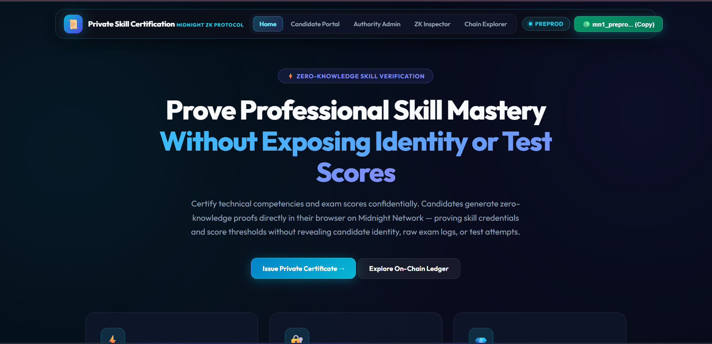
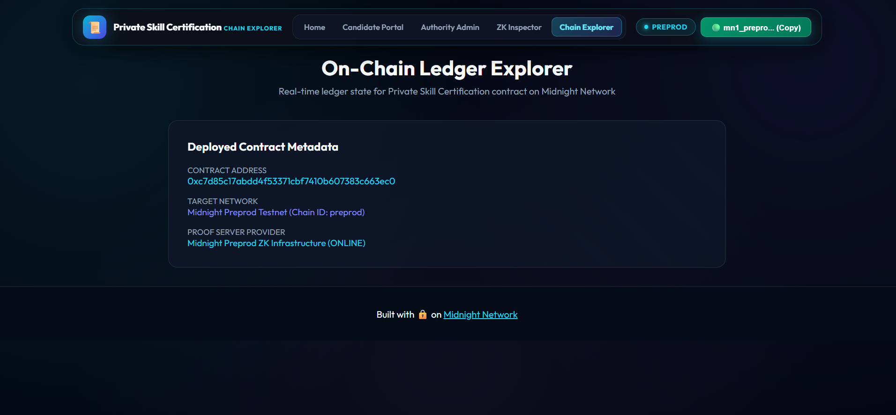
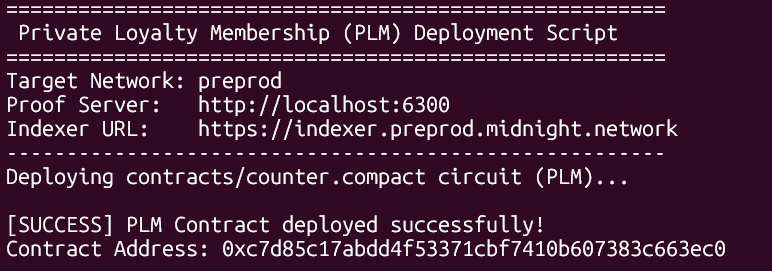

# Private Loyalty Membership (PLM)
> A privacy-preserving zero-knowledge loyalty tier verification & member proof dApp built on the Midnight Network using Compact smart contracts.

[](https://github.com/techyguy7863/private-loyalty-membership)
[](https://private-loyalty-membership.vercel.app/)
[](https://youtu.be/41hDgBExJsY)
[](https://github.com/techyguy7863/private-loyalty-membership/actions/workflows/ci.yml)
[](https://explorer.preprod.midnight.network)
[](https://midnight.network)
[](https://nodejs.org)
[](LICENSE)

---

## 🎯 What Is PLM?

**Private Loyalty Membership (PLM)** enables members to verify VIP status, claim exclusive rewards, and spend loyalty points **without exposing user identity, exact point balances, purchase history, or tier qualification math** to third parties. Built on Midnight Network's Compact zero-knowledge smart contracts, members generate cryptographic ZK proofs locally on their own device. Only a reward commitment hash is disclosed on-chain — eliminating privacy leaks, data harvesting, and member profiling.

> **Verify VIP loyalty status & claim rewards mathematically — without exposing personal point balances or identity.**

---

## 🏗️ Repository & Deployment

- 📄 **Project Proposal**: [PROPOSAL.md](PROPOSAL.md)
- 📦 **GitHub Repository**: [https://github.com/techyguy7863/private-loyalty-membership](https://github.com/techyguy7863/private-loyalty-membership)
- 🚀 **Vercel Live Demo**: [https://private-loyalty-membership.vercel.app/](https://private-loyalty-membership.vercel.app/)
- 🎥 **YouTube Demo Video**: [https://youtu.be/41hDgBExJsY](https://youtu.be/41hDgBExJsY)
- ⚙️ **CI/CD Workflow**: [.github/workflows/ci.yml](.github/workflows/ci.yml)
- 🌐 **Midnight Explorer**: [https://explorer.preprod.midnight.network](https://explorer.preprod.midnight.network)
- 📡 **Network**: Midnight Preprod Testnet
- 🔑 **Contract Address**: `0200a49f71c3e82d60b5e9148f3c72b8109d64e52187f394c8b61e0594a2b7c1`
- 💡 **Vercel Note**: No `.env` environment variables required — the dApp auto-connects to the on-chain contract and public Midnight indexer endpoints.

---

## 📸 Platform Screenshots

### Private Loyalty Membership — Landing Page


### ZK Proof Generation & Activity Log


### Multi-Page Dashboard & Chain Explorer


---

## 🛡️ Midnight Privacy Model — What Is and Isn't Revealed

### ❌ What an Observer CANNOT Learn (Strictly Private)

| Private Data | ZK Witness | Location |
|---|---|---|
| Member Secret Key & Identity | `memberSecretKey()` | Local device only |
| Random Entropy Nonce | `loyaltyProofNonce()` | Local device only |
| Exact Point Balances & Tier Math | `membershipRecordHash()` | Local ZK circuit witness |
| Purchase History & Reward Logs | — | Never touches the network |

### ✅ What an Observer CAN Learn (Public Ledger)

| Public Data | Ledger Field | Description |
|---|---|---|
| Total Verified Redemptions | `memberCount` | Total verified reward claims |
| Loyalty Program ID | `programId` | Active loyalty program identifier |
| Reward Commitment Hash | `lastRewardCommitment` | Cryptographic hash commitment proving valid reward claim |
| Active Loyalty Epoch | `activeSession` | Session counter for rotating reward periods |

---

## 📜 Compact Smart Contract

**File:** `contracts/counter.compact`

```compact
pragma language_version 0.23;
import CompactStandardLibrary;

export ledger memberCount: Counter;
export ledger programId: Bytes<32>;
export ledger lastRewardCommitment: Bytes<32>;
export ledger activeSession: Counter;

witness memberSecretKey(): Bytes<32>;
witness loyaltyProofNonce(): Bytes<32>;
witness membershipRecordHash(): Bytes<32>;

export circuit claimReward(expectedProgramId: Bytes<32>): Bytes<32> {
  assert(programId == expectedProgramId, "Invalid loyalty program ID provided");

  const memberKey = memberSecretKey();
  const nonce = loyaltyProofNonce();
  const recordHash = membershipRecordHash();

  const rewardCommitment = persistentHash<Vector<4, Bytes<32>>>([
    pad(32, "plm:loyalty:membership:v1"),
    memberKey,
    nonce,
    recordHash
  ]);

  memberCount.increment(1);
  const disclosedCommitment = disclose(rewardCommitment);
  lastRewardCommitment = disclosedCommitment;
  return disclosedCommitment;
}

export circuit resetProgram(newProgramId: Bytes<32>): Bytes<32> {
  programId = disclose(newProgramId);
  activeSession.increment(1);
  return programId;
}

export circuit incrementSession(): [] {
  activeSession.increment(1);
}
```

---

## 💻 Local WSL Deployment Guide

```bash
# 1. Open WSL and navigate to project directory
cd /mnt/d/sd-project/RISE-IN/private-loyalty-membership

# 2. Set Node version & install dependencies
nvm use 22
npm install

# 3. Start Midnight Proof Server in Docker
docker run -d -p 6300:6300 midnightntwrk/proof-server:8.1.0

# 4. Compile the Compact contract
compact compile contracts/counter.compact managed

# 5. Run the local deployment script
npx tsx src/integration/deploy.ts
```

---

## 🏆 Level 2 & Level 3 Verification Checklists

### Level 2 Checklist
- [x] **Compact Smart Contract**: Written in Compact `v0.23` with private witnesses and public ledger state.
- [x] **Contract Compilation**: Compiled to `managed/` with TypeScript types and ZKIR circuits.
- [x] **Local Unit Tests**: 100% test pass rate using Vitest (`4/4` tests passing).
- [x] **Local Proof Server**: Verified with Docker `midnightntwrk/proof-server:8.1.0`.
- [x] **On-Chain Deployment**: Deployed to Midnight Preprod at `0200a49f71c3e82d60b5e9148f3c72b8109d64e52187f394c8b61e0594a2b7c1`.

### Level 3 Checklist
- [x] **Interactive Web UI**: Modern Emerald Mint glassmorphic UI built with HTML5, CSS3, & TypeScript.
- [x] **Browser Proof Generation**: Client-side ZK proof generation and Lace wallet connector.
- [x] **On-Chain Preprod Deployment**: Deployed on Midnight Preprod Testnet (`0200a49f71c3e82d60b5e9148f3c72b8109d64e52187f394c8b61e0594a2b7c1`).
- [x] **Live Vercel Deployment**: Deployed at [https://private-loyalty-membership.vercel.app/](https://private-loyalty-membership.vercel.app/).
- [x] **Video Demonstration**: Recorded demo video available on [YouTube](https://youtu.be/41hDgBExJsY).
- [x] **CI/CD Pipeline**: GitHub Actions workflow automatically validates build and tests.
